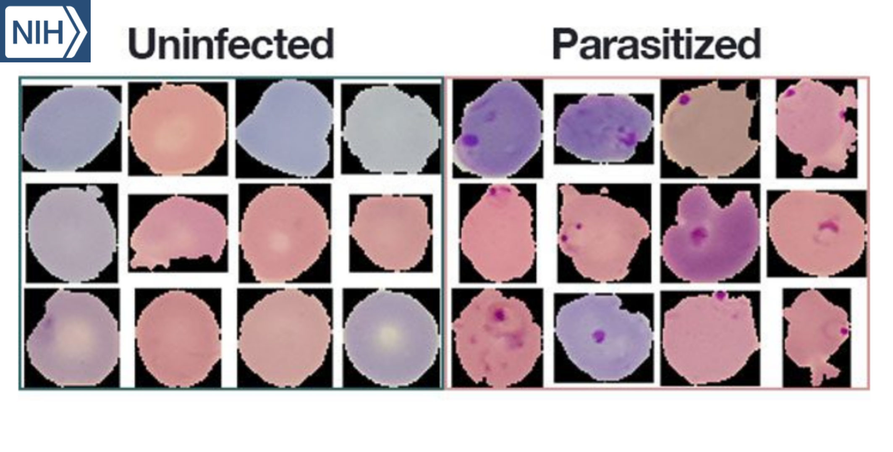

# Détection Du Paludisme
 

## Introduction :

-  Le paludisme, une maladie grave transmise par les moustiques, affecte des millions chaque année, surtout dans les régions tropicales.
-  Actuellement, le diagnostic repose sur l'examen microscopique des frottis sanguins, nécessitant une expertise médicale.
-  Ce projet développe un modèle de réseau neuronal pour différencier rapidement et avec précision les cellules sanguines infectées par le paludisme des cellules saines
-  Structure de projet :
    - 1.Manipulation de la Donnée : Préparation et augmentation des données pour l'entraînement des modèles.
    - 2.Entraînement de Modèles : Implémentation et entraînement de trois modèles CNN différents.
    - 3.Évaluation des Modèles : Test et évaluation des performances des modèles sur un jeu de données de test.

## Références :

- Informations sur l'ensemble de données et les fichiers :
    - Données est extrait du site officiel des NIH, lien vers le dataset : <a href="https://ceb.nlm.nih.gov/repositories/malaria-datasets/">NIH link </a>
    - Lien vers le dataset des images : <a href="https://drive.google.com/drive/folders/1BnA8bTFuCeAmhU9rvAyHmzVUMTxFGGAU?usp=sharing">BCI</a>
    - Lien vers poids des modèles : <a href="https://drive.google.com/file/d/1miYwxaa_OUW39GTYA7b5iw2DnJfJqfAf/view?usp=drive_link">Weights.h5</a>
- My-links :
    - Git_hub : <a href="https://github.com/SouLayman2022/Blood_cells_Classification.git">Repo GitHub</a>
    - linked_in : <a href="https://www.linkedin.com/in/soulayman-el-guasmi-13b890240/">Linkedin page</a>
    - Get to know me ! <a href="https://soulayman2022.github.io/Data_Scientist_Portfolio/">My Portfolio page</a>